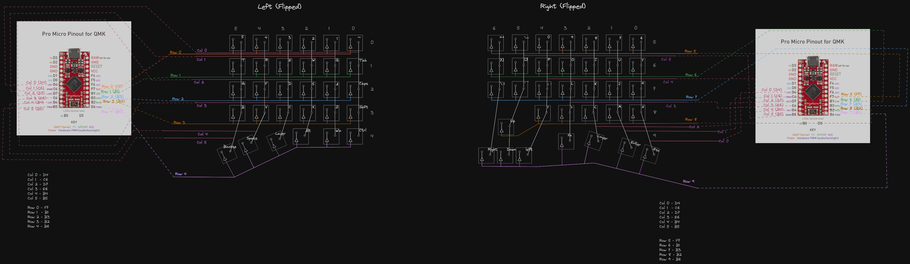

## gvlsplit - custom handwired split keyboard

Licence: Free for personal use. No commercial use allowed without consent.

This repository contains the keyboard case STL files for my custom split keyboard.

### 3d printing

You can 3d print in whatever filament you prefer, I used PETG.
No gcode provided as I don't know your setup.

Bottom and top cases are printed with

0.20 layer height

8 perimiters/walls.

7 bottom layers

30% infil

Supports (for the usb-c and ttrs openings)

For the plates

set first layer to 0.20 and the rest to 0.15

4 perimeters/walls.

5 bottom and 5 top layers

30% infil.

The reason for this is because MX switches need 1.5mm relief so they grab the plate.

Depending how good your printer is set up this can be a hit or miss so play around with it.

My printer is a cheap one and some switches do grab properly and some don't so whenever I would need to change a keycap I use pliers to keep the switch in place while pulling the keycap.

The top and bottom cases are a tight fight and don't need screws but I've also added holes for 4mmx3mm round magnets. So far I haven't had the need to add the magnets but that might change in the future.

So make sure your printer is at least decent on accuracy.

### Components

The keyboard has 60 keys arranged in 5x6 grid, so you need the get the following to build it (buy more than what you need just in case):

2 [Promicros - Type-C USB 3-6V New](https://www.aliexpress.com/item/1005001622051348.html?spm=a2g0o.order_list.order_list_main.29.42161802jJwfOh)

2 [TTRS ports](https://www.aliexpress.com/item/4000114275750.html?spm=a2g0o.order_list.order_list_main.151.42161802jJwfOh)

60 Switches

[Keycaps - find a set that has 2x 1.25u spacebars, 1u modifiers](https://www.aliexpress.com/item/1005004536833402.html?spm=a2g0o.order_list.order_list_main.59.42161802jJwfOh)

60 [1N4148 Diodes](https://www.aliexpress.com/item/32660088529.html?spm=a2g0o.order_list.order_list_main.41.42161802jJwfOh)

60 [Kalih Hotswap Sockets](https://www.aliexpress.com/item/1005004324329102.html?spm=a2g0o.order_list.order_list_main.35.42161802jJwfOh)

1 [TRRS cable 3.5mm 4pole M2M](https://www.aliexpress.com/item/1005001802977701.html?spm=a2g0o.order_list.order_list_main.156.42161802jJwfOh)

12 [4x3 magnets](https://www.aliexpress.com/item/1005001832587465.html?spm=a2g0o.order_list.order_list_main.81.42161802jJwfOh)

[Single copper wire for wiring the grid 26 or 24 AWG](https://www.aliexpress.com/item/1005004635987651.html?spm=a2g0o.order_list.order_list_main.73.42161802jJwfOh)

[Soft silicon wire for grid to promicro or strip an old usb cable](https://www.aliexpress.com/item/4001182852890.html?spm=a2g0o.order_list.order_list_main.5.42161802jJwfOh)

[Poron foam for gaskets](https://www.aliexpress.com/item/1005005171752968.html?spm=a2g0o.order_list.order_list_main.17.42161802jJwfOh)

[Rubber feet](https://www.aliexpress.com/item/1005004000171049.html?spm=a2g0o.order_list.order_list_main.101.42161802jJwfOh)

### Wiring

### Licence

Again FREE FOR PERSONAL USE. NO COMMERCIAL USE ALLOWED WITHOUT CONSENT.

Why?

It's funny to even think this would end up being a product BUT the entry to split keyboards is pretty high from what I've seen.

I'd hate it if it ends up being sold at such a premium price.

Although there are "cheap" lily58 or softle kits I find it funny that they still cost over $120+ to get a complete keyboard kit with cases.

I see components being sold 2x or 3x their actual price and even though it's a business for someone such markup doesn't help the community.

Selling a case for lily58 for $50+ is just too... much.

For example to print this keyboard which has actual parts which are not flat and you don't need standoffs and screws to put together costs $10 in filament at the most.

Takes around 400g of filament and 10 hours per side to print everything.

And it doesn't sound like you are bashing plastic parts together, nor does it have hollowness since it has thick walls and its gasket mounted which also helps with how the keyboard sounds and feels and won't wake up people in the same room as you.

The only sound produced is from the switches and with some lube the keyboard sounds even better.
